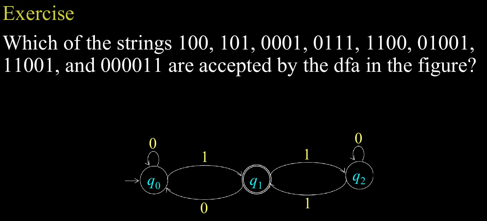

# DFA Visualizer

Interactive DFA Visualizer and String Processor built with Streamlit.

The app lets you define a deterministic finite automaton, inspect its graph, and step through string simulation one transition at a time or with autoplay.

## Features

- Define a DFA using the quintuple $(Q, \Sigma, \delta, q_0, F)$.
- Render the DFA as a directed graph.
- Validate DFA structure before simulation starts.
- Simulate a single input string and see each transition step.
- Step forward and backward through the simulation.
- Use autoplay with Fast, Medium, or Slow speed presets.
- Load the included sample DFA for quick testing.

## Requirements

- Python 3.9 or newer
- `uv` package manager is recommended for environment management since it is lightweight and fast
- You can use `pip` if you are more comfortable

## Installation

1. Open a terminal in the project folder and clone the project

```bash
git clone https://github.com/SDnf932/DFA_Visualizer.git
```

2. Install the `uv` package manager:

```bash
curl -LsSf https://astral.sh/uv/install.sh | sh
```

> _Note: For Windows, follow the instructions on the [uv installation page](https://docs.astral.sh/uv/getting-started/installation/)_

3. Create and sync the environment:

```bash
uv sync
```

If you prefer not to use `uv`, install the dependencies manually:

```bash
pip install streamlit graphviz
```

4. Activate the Virtual Environment

```bash
source .venv/bin/activate
```

> _In Windows, you can activate the virtual environment with:_

```bash
.venv\Scripts\activate # for Command Prompt or
.venv\Scripts\Activate.ps1 # for PowerShell
```

## Start the App

Run the Streamlit application with:

```bash
uv run streamlit run app.py
```

If you installed dependencies with `pip`, you can start it with:

```bash
streamlit run app.py
```

Streamlit will open a local browser page, usually at `http://localhost:8501`.

## How to Use

### 1. Define the DFA

In the **Define DFA quintuple (Q, Sigma, delta, q0, F)** section, fill in these fields:

- **States Q**: comma-separated state names, for example `q0,q1,q2`
- **Alphabet Sigma**: comma-separated input symbols, for example `0,1`
- **Start state q0**: choose the initial state from the dropdown
- **Final states F**: select one or more accepting states
- **Transitions delta**: enter one transition per line using this format:

```text
state,symbol->next_state
```

Example:

```text
q0,0->q0
q0,1->q1
q1,0->q0
q1,1->q2
q2,0->q2
q2,1->q1
```

Rules to keep in mind:

- Every state and symbol pair must have exactly one transition.
- The start state and accepting states must be part of the state set.
- Any symbol used in a transition must appear in the alphabet.

### 2. Change the Input String

In the **DFA Simulation** section, edit the **Input string w** field to test a new string.

Example inputs:

- `101`
- `0001`
- `11001`

The app will reject any string that contains a symbol not listed in the alphabet.

### 3. Run the Simulation

Click **Build & Auto-Play** to validate the DFA and start the simulation.

After that, you can:

- Use **Next Step** to advance one transition at a time.
- Use **Previous Step** to move backward through the trace.
- Use **Reset** to clear the current simulation.
- Use **Fast**, **Medium**, or **Slow** to change autoplay speed.

## What You Will See

- A DFA graph with the start state and accepting states marked.
- The active state highlighted during simulation.
- The active edge highlighted for the current transition.
- A transition table showing the steps taken so far.
- A final acceptance or rejection message.
- A trace of the path followed by the input string.

## Sample DFA

The app starts with a built-in example DFA so you can test it immediately:

- States: `q0,q1,q2`
- Alphabet: `0,1`
- Start state: `q0`
- Final state(s): `q1`
- Sample input strings: `101`

Use the existing values as a template, then edit the states, alphabet, transitions, and input string to explore different DFAs.

## Further testing:

Here are some strings for you to test based on the exercise in the image below:
`100,101,0001,0111,1100,01001,11001,000011`



## Notes

- If the DFA definition is invalid, the app shows the specific errors before simulation begins.
- The app is designed for DFA only, not NFA automata.
